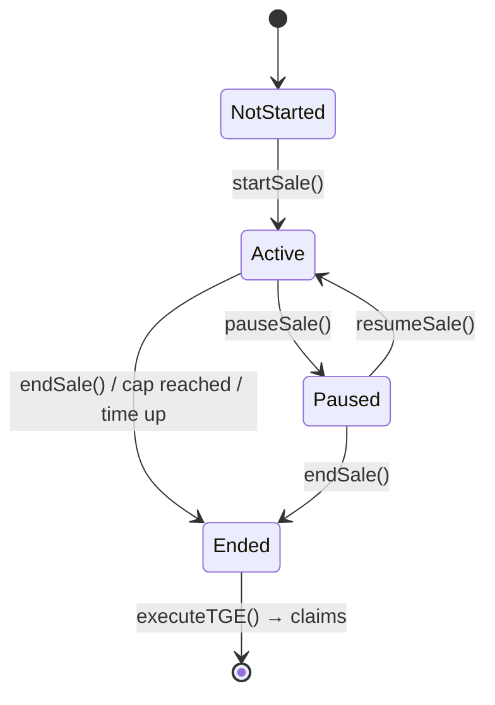
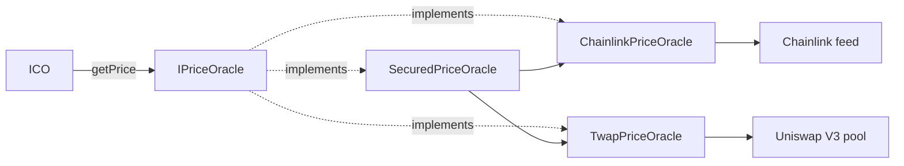

<p align="center">
  <a href="https://redduck.io">
    <picture>
      <source media="(prefers-color-scheme: dark)" srcset=".github/assets/redduck-logo-dark.svg">
      
    </picture>
  </a>
</p>

<h1 align="center">ICO Template</h1>

<p align="center">
  <b>A token sale in Solidity — whitelisting, oracle pricing and vesting, built to be read.</b>
</p>

---

A Solidity + Hardhat template for an **ICO (Initial Coin Offering)** — a token sale built from the mechanisms real sales actually use: buyer whitelisting, oracle-priced multi-asset payments (including a Uniswap V3 TWAP), and vesting with a Token Generation Event (TGE).

## Built with

| Area | Technology |
| --- | --- |
| Contracts | Solidity 0.8.28, [OpenZeppelin Contracts](https://www.openzeppelin.com/contracts) |
| Price oracles | Chainlink price feeds, Uniswap V3 TWAP |
| Tooling | [Hardhat](https://hardhat.org/), `@nomicfoundation/hardhat-toolbox-viem`, [Viem](https://viem.sh/), TypeScript |
| Testing | Hardhat + Chai — fixture-based unit tests plus a live-node smoke test |
| Config | `dotenv`, `ts-node` |

## The mechanisms, and why each exists

An ICO's core idea is simple: send money, get tokens at a fixed price, during a fixed window. Everything else in this template exists to answer one of four practical questions a real sale has to solve:

| Question | Mechanism | Contract |
|---|---|---|
| Who is allowed to buy? | An owner-managed verification registry | [`Whitelist.sol`](contracts/Whitelist.sol) |
| What is this payment worth? | Pluggable price sources behind one interface | [`oracles/`](contracts/oracles) |
| How do we stop a single manipulated price from being trusted? | Cross-check a live oracle against a time-weighted average | [`SecuredPriceOracle.sol`](contracts/oracles/SecuredPriceOracle.sol) |
| When do buyers actually receive tokens? | Record a claim, don't transfer immediately | Vesting logic in [`ICO.sol`](contracts/ICO.sol) |

## Architecture

```
contracts/
├── ICO.sol                    # The sale: whitelist-gated, oracle-priced buys, vesting, settlement
├── Token.sol                  # Plain ERC-20 being sold
├── Whitelist.sol              # Owner-managed buyer verification registry
├── interfaces/
│   ├── IICO.sol                 # Errors & events
│   ├── IWhitelist.sol
│   ├── IPriceOracle.sol         # Common interface every price source implements
│   ├── AggregatorV3Interface.sol  # Chainlink feed interface (local copy)
│   └── IUniswapV3Pool.sol         # Uniswap V3 pool interface (local copy)
├── oracles/
│   ├── ChainlinkPriceOracle.sol # Wraps one Chainlink feed, with staleness checks
│   ├── TwapPriceOracle.sol      # Wraps a Uniswap V3 pool's time-weighted average price
│   └── SecuredPriceOracle.sol   # Chainlink + TWAP, reverts if they disagree too much
├── libraries/
│   └── TickMath.sol             # Uniswap's tick <-> sqrt price math (vendored, unmodified)
├── structs/                   # Rules (sale config) and Vesting (per-buyer position)
├── enums/SaleState.sol        # Sale lifecycle states
└── mocks/                     # Test-only ERC-20, Chainlink feed, Uniswap pool, price oracle
```

### Sale lifecycle



`Active` isn't just a stored flag: every purchase and withdrawal guard independently re-checks the real time window and the token cap, so the sale behaves correctly even if nobody ever calls the permissionless `updateSaleStatus()` — that function only exists to make the *stored* `state` variable convenient for off-chain readers (a subgraph, a frontend) that don't want to recompute the condition themselves.

### Oracle abstraction



`ICO.sol` never talks to Chainlink or Uniswap directly — it only calls `IPriceOracle.getPrice()` on whatever address the owner registered for a payment asset with `acceptPaymentToken(token, oracle)`. This is what lets the same sale contract treat "a stablecoin with a great Chainlink feed" and "a token that only trades on one DEX pool" through the same code path, just with a different adapter behind the interface:

- **`ChainlinkPriceOracle`** — the default choice. Fast, and for major pairs backed by many independent data providers. Its risk is being a single external dependency: if the feed stalls or misreports, the sale trusts it blindly.
- **`TwapPriceOracle`** — reads a Uniswap V3 pool's `observe()` data and averages the price over a window (e.g. 15 minutes). Expensive to move: an attacker needs to hold a distorted price for the *entire* window, not one block, which is what makes a TWAP resistant to flash-loan-style manipulation. Its weakness is the opposite of a push oracle's — it reacts slowly and is only as good as the pool's own liquidity.
- **`SecuredPriceOracle`** — the two together. Returns the Chainlink price, but only after confirming it is within `maxDeviationBps` of the TWAP; reverts otherwise. This is the standard pattern for pricing an asset whose DEX liquidity is thin enough that you don't want to trust either source alone.

### Buying and vesting

Verified buyers call `buyWithETH()` or `buyWithERC20(token, amount)`. ERC-20 amounts are converted to an ETH equivalent using two oracle reads — the payment token's USD price and ETH's USD price — so the sale's price and purchase limits are always denominated in ETH regardless of which asset was used to pay. A purchase that would cross the token cap is clamped to the remaining amount (ETH purchases refund the difference in the same transaction; ERC-20 purchases simply cost less).

Purchases don't deliver tokens — they record a vesting position:

```
unlocked(t) = tgeAmount + (total − tgeAmount) × min(t − cliffEnd, D) / D
claimable   = unlocked(t) − alreadyClaimed
```

where `cliffEnd = tgeDate + cliffDuration` and `D = vestingDuration`. `tgeAmount` (e.g. 10% of the purchase) is claimable as soon as the owner runs `executeTGE()` on or after the TGE date; the rest vests linearly once the cliff ends. This is what stops every buyer from dumping their full allocation the moment the sale ends.

> Vesting here is deliberately built into the sale: positions are created by `buyWithETH()` / `buyWithERC20()`, so there is no separate allocation list to maintain. If you need vesting *without* a sale — an airdrop or a pre-agreed allocation table — our [**Vesting templates**](https://github.com/RedDuckTeam/Vesting) cover that case, with three ways to authorize a claim (on-chain mapping, Merkle proof, or an owner signature) and a gas comparison between them.

## Getting started

```bash
npm install
npx hardhat compile
npx hardhat test
```

Deploy the core stack to a local node:

```bash
npx hardhat node          # terminal 1
npm run deploy:localhost  # terminal 2
```

The deploy script prints the follow-up calls needed to register payment oracles (it doesn't hardcode any, since real feed/pool addresses are network-specific) and to whitelist buyers and start the sale. Each run also writes the deployed addresses to `deployments/<network>.json` (gitignored — it's a per-deployer record, not shared repo state).

### Deploying to a public network

Copy `.env.example` to `.env` and fill in an RPC URL (e.g. from Alchemy or Infura), a deployer private key, and — optionally, for verification — an Etherscan API key. A network only shows up in `hardhat.config.ts` once its RPC URL and the private key are both set, so an unconfigured `--network mainnet` fails fast instead of silently doing nothing.

```bash
npm run deploy:sepolia    # public testnet
npm run deploy:mainnet    # production — see the confirmation prompt below
```

Deploying to `mainnet` pauses for a typed confirmation (`Type "deploy" to continue`) before sending any transaction, since there's no undo once real ETH is spent. Skip it in non-interactive contexts (CI, a scripted release) with `SKIP_MAINNET_CONFIRM=true`.

Verify the deployed contracts once you have their addresses and constructor arguments:

```bash
npm run verify:sepolia -- <address> <constructor arg 1> <constructor arg 2> ...
npm run verify:mainnet -- <address> <constructor arg 1> <constructor arg 2> ...
```

Real Chainlink feed addresses (for `acceptPaymentToken`) are listed at [docs.chain.link/data-feeds](https://docs.chain.link/data-feeds/price-feeds/addresses).

To see the whole lifecycle run against real deployed contracts — not the fixture-based unit tests, which redeploy fresh instances per test on an in-process EVM — run the smoke test against a live local node:

```bash
npx hardhat node                  # terminal 1
npm run smoke-test:localhost      # terminal 2
```

It deploys its own Token/Whitelist/ICO plus a mock payment token and Chainlink adapters, then drives an ETH purchase, an oracle-priced ERC-20 purchase, TGE, vesting claims, and settlement as separate mined transactions, printing balances at each step.

## Design notes & trade-offs

- **Whitelist vs Merkle proofs.** This template uses a simple `mapping(address => bool)` registry — easy to read and to inspect on-chain, but each addition costs a transaction (mitigated here with a batch-add function). For a buyer list in the tens of thousands, storing a single Merkle root and having buyers submit a proof with their purchase is far cheaper per-buyer, at the cost of the registry being less directly inspectable. The same trade-off, applied to token claims rather than to the buyer list, is worked through in [`MerkleVesting`](https://github.com/RedDuckTeam/Vesting) — including what it costs in gas next to a plain on-chain mapping.
- **Why an oracle interface instead of calling Chainlink directly.** Decoupling `ICO.sol` from any specific price source is what makes `SecuredPriceOracle` possible without touching the sale contract at all — it's just another address that answers `getPrice()`.
- **Oracle safety.** `ChainlinkPriceOracle` rejects non-positive prices, unanswered rounds, and answers older than `maxStaleness`. Tune the staleness bound per feed — each Chainlink feed has its own heartbeat.
- **Custom errors over require strings.** Cheaper in gas and precise to test against.
- **Checks-effects-interactions + `nonReentrant`.** State is updated before external calls; purchase, claim and withdrawal entry points carry a reentrancy guard.
- **Rules are locked once the sale starts.** No admin lever to move the price or cap out from under buyers mid-sale.

## Testing

- [`test/ICO.test.ts`](test/ICO.test.ts) walks through the full lifecycle: rules validation, whitelist gating, ETH and ERC-20 purchases (including oracle-staleness and cap-clamping edge cases), TGE, cliff/vesting math over time, and settlement.
- [`test/oracles/`](test/oracles) tests each adapter in isolation — including a decimals-mismatch case and a tick-direction sanity check for the TWAP adapter, and the deviation math for the secured combination.

Reading the tests top-to-bottom is a good way to learn how the pieces fit together.

## License

[MIT](LICENSE) © RedDuck Limited
